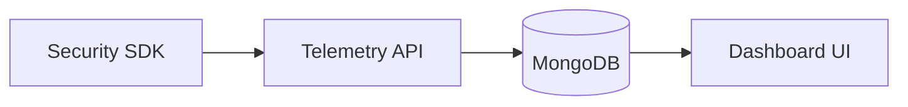

# 🧠 System Architecture Overview

This document outlines the high-level architecture of the OWASP PCI DSS Toolkit project.

## 📦 Components

- **Web Security SDK (Client-side)**  
  Collects script inventory, bot detection metrics, and sends telemetry to backend.

- **Backend API (Node.js/Express)**  
  Handles telemetry ingestion, validation, and data storage (MongoDB).

- **Database (MongoDB)**  
  Stores telemetry logs with session metadata, scripts, anomalies, and bot scores.

- **Dashboard (React/Next.js)**  
  Displays compliance data and allows exporting PCI DSS reports.

## 🔁 Data Flow Diagram (via Mermaid)

### 🗂️ Architecture Flow

✳️ **Why It Matters:**  
This helps onboard contributors quickly, reduces setup errors, and explains the complete data flow in the system.
